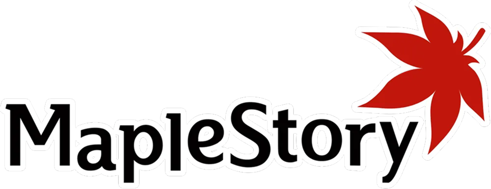
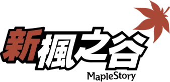
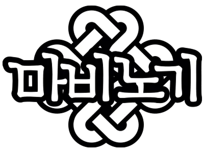
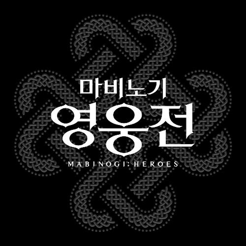
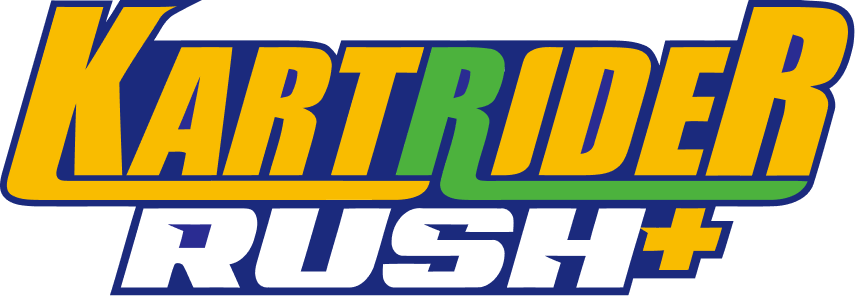
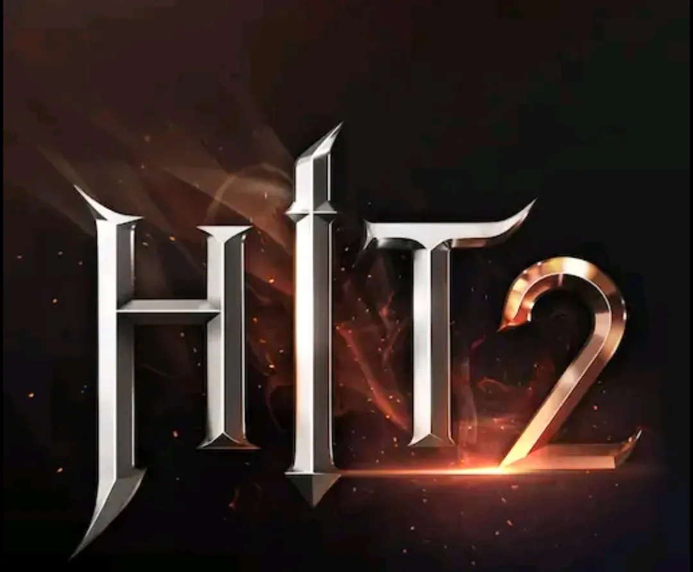
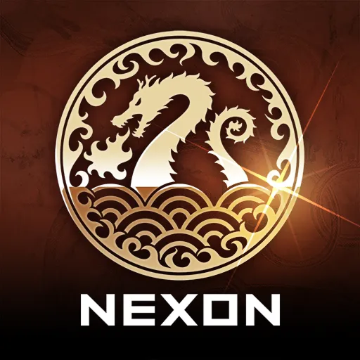
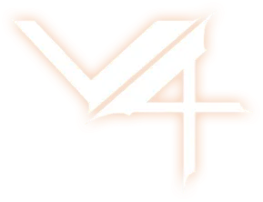
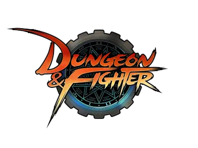
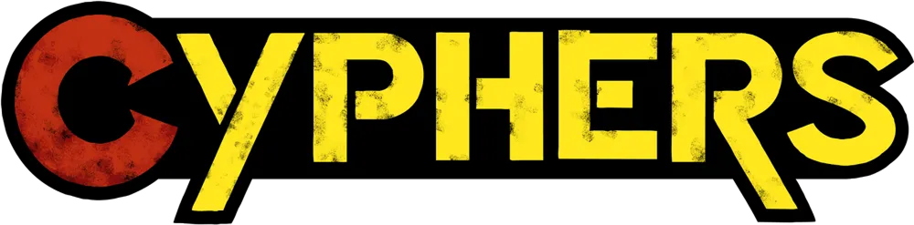

# nexon-open-api

> Type-safe Nexon Open API SDK for TypeScript/JavaScript

[](https://www.npmjs.com/package/nexon-open-api)
[](https://opensource.org/licenses/MIT)
[](https://nodejs.org/)

[Nexon Open API](https://openapi.nexon.com/) 전체 게임을 TypeScript로 감싼 SDK입니다. 외부 의존성 없이 네이티브 `fetch`만 사용하며, CJS/ESM 듀얼 출력을 지원합니다.

## 설치

```bash
npm install nexon-open-api
# or
yarn add nexon-open-api
# or
pnpm add nexon-open-api
```

## 빠른 시작

### 메이플스토리

```ts
import { NexonClient } from 'nexon-open-api';

const client = new NexonClient({ apiKey: 'YOUR_API_KEY' });

// OCID 조회
const ocid = await client.maplestory.getOcid('캐릭터명');

// 캐릭터 기본 정보
const basic = await client.maplestory.character.getBasic({ ocid });
console.log(`${basic.character_name} Lv.${basic.character_level}`);
```

### FC Online

```ts
// OUID 조회
const ouid = await client.fcOnline.getOuid('닉네임');

// 유저 기본 정보
const basic = await client.fcOnline.getBasic(ouid);
console.log(`${basic.nickname} (Lv.${basic.level})`);

// 매치 기록 조회
const matchIds = await client.fcOnline.getMatchList({ ouid, matchtype: 50, limit: 10 });
const detail = await client.fcOnline.getMatchDetail(matchIds[0]!);
```

> API 키는 [Nexon Open API 포털](https://openapi.nexon.com/)에서 발급받을 수 있습니다.

## 주요 특징

- **Type-safe** — 모든 API 응답에 대한 완전한 TypeScript 타입 정의
- **Branded Types** — `OCID`, `OUID`, `GuildId`, `NexonDate` 브랜드 타입으로 컴파일 타임 안전성
- **자동 재시도** — 429 (Rate Limit) / 503 응답 시 지수 백오프 자동 재시도
- **에러 분류** — `NexonRateLimitError`, `NexonAuthError` 등 `instanceof`로 에러 분기
- **외부 의존성 0** — Node.js 18+ 네이티브 `fetch` 사용
- **멀티 게임** — 하나의 `NexonClient`로 모든 게임 접근

## 지원 게임

<!-- 아이콘 파일: docs/assets/games/{game}.png (48x48 권장) -->

<div align="center">
<table>
<tr>
<td align="center" valign="top" width="180">
<br>
<br>
<b>EA SPORTS FC 온라인</b><br>
<br>
<br>
완료일 : 2025-06-15<br>
수정일 : —<br>
<a href="docs/fc-online.md">레퍼런스</a><br>
<br>
</td>
<td align="center" valign="top" width="180">
<br>
<br>
<b>메이플스토리</b><br>
<br>
<br>
완료일 : 2025-06-01<br>
수정일 : —<br>
<a href="docs/maplestory.md">레퍼런스</a><br>
<br>
</td>
<td align="center" valign="top" width="180">
<br>
<br>
<b>MapleStorySEA</b><br>
<br>
<br>
&nbsp;<br>
&nbsp;<br>
&nbsp;<br>
<br>
</td>
<td align="center" valign="top" width="180">
<br>
<br>
<b>MapleStoryTaiwan</b><br>
<br>
<br>
&nbsp;<br>
&nbsp;<br>
&nbsp;<br>
<br>
</td>
</tr>
<tr>
<td align="center" valign="top" width="180">
<br>
<br>
<b>서든어택</b><br>
<br>
<br>
&nbsp;<br>
&nbsp;<br>
&nbsp;<br>
<br>
</td>
<td align="center" valign="top" width="180">
<br>
<br>
<b>퍼스트 디센던트</b><br>
<br>
<br>
&nbsp;<br>
&nbsp;<br>
&nbsp;<br>
<br>
</td>
<td align="center" valign="top" width="180">
<br>
<br>
<b>마비노기</b><br>
<br>
<br>
&nbsp;<br>
&nbsp;<br>
&nbsp;<br>
<br>
</td>
<td align="center" valign="top" width="180">
<br>
<br>
<b>마비노기 영웅전</b><br>
<br>
<br>
&nbsp;<br>
&nbsp;<br>
&nbsp;<br>
<br>
</td>
</tr>
<tr>
<td align="center" valign="top" width="180">
<br>
<br>
<b>메이플스토리M</b><br>
<br>
<br>
&nbsp;<br>
&nbsp;<br>
&nbsp;<br>
<br>
</td>
<td align="center" valign="top" width="180">
<br>
<br>
<b>카트라이더 러쉬플러스</b><br>
<br>
<br>
&nbsp;<br>
&nbsp;<br>
&nbsp;<br>
<br>
</td>
<td align="center" valign="top" width="180">
<br>
<br>
<b>바람의나라</b><br>
<br>
<br>
&nbsp;<br>
&nbsp;<br>
&nbsp;<br>
<br>
</td>
<td align="center" valign="top" width="180">
<br>
<br>
<b>히트2</b><br>
<br>
<br>
&nbsp;<br>
&nbsp;<br>
&nbsp;<br>
<br>
</td>
</tr>
<tr>
<td align="center" valign="top" width="180">
<br>
<br>
<b>크레이지 아케이드</b><br>
<br>
<br>
&nbsp;<br>
&nbsp;<br>
&nbsp;<br>
<br>
</td>
<td align="center" valign="top" width="180">
<br>
<br>
<b>바람의나라: 연</b><br>
<br>
<br>
&nbsp;<br>
&nbsp;<br>
&nbsp;<br>
<br>
</td>
<td align="center" valign="top" width="180">
<br>
<br>
<b>V4</b><br>
<br>
<br>
&nbsp;<br>
&nbsp;<br>
&nbsp;<br>
<br>
</td>
<td align="center" valign="top" width="180">
<br>
<br>
<b>던전앤파이터</b><br>
<br>
<br>
&nbsp;<br>
&nbsp;<br>
&nbsp;<br>
<br>
</td>
</tr>
<tr>
<td align="center" valign="top" width="180">
<br>
<br>
<b>사이퍼즈</b><br>
<br>
<br>
&nbsp;<br>
&nbsp;<br>
&nbsp;<br>
<br>
</td>
<td></td>
<td></td>
<td></td>
</tr>
</table>
</div>

## 에러 처리

SDK는 Nexon API 에러 코드를 구체적인 에러 클래스로 분류합니다.

```ts
import {
  NexonRateLimitError,
  NexonAuthError,
  NexonNotFoundError,
  NexonDataNotReadyError,
} from 'nexon-open-api';

try {
  const basic = await client.maplestory.character.getBasic({ ocid });
} catch (err) {
  if (err instanceof NexonRateLimitError) {
    // 429 — 요청 한도 초과 (SDK가 자동으로 3회 재시도 후 throw)
    console.log(`재시도 대기: ${err.retryAfterMs}ms`);
  }
  if (err instanceof NexonAuthError) {
    // 403 — API 키 오류 또는 권한 없음
  }
  if (err instanceof NexonNotFoundError) {
    // 캐릭터/길드를 찾을 수 없음
  }
  if (err instanceof NexonDataNotReadyError) {
    // 해당 날짜 데이터 미준비 (매일 오전 1시 KST 이후 갱신)
  }
}
```

## 설정 옵션

```ts
const client = new NexonClient({
  apiKey: 'YOUR_API_KEY',
  timeoutMs: 10_000,        // 요청 타임아웃 (기본: 10초)
  maxRetries: 3,             // 429/503 재시도 횟수 (기본: 3)
  retryBaseDelayMs: 500,     // 재시도 기본 대기시간 (기본: 500ms)
  debug: true,               // 콘솔 디버그 로그 활성화
});
```

### 커스텀 로거

```ts
const client = new NexonClient({
  apiKey: 'YOUR_API_KEY',
  logger: {
    onRequest: (info) => console.log(`→ ${info.method} ${info.url}`),
    onResponse: (info) => console.log(`← ${info.status} (${info.durationMs}ms)`),
    onRetry: (info) => console.warn(`↩ retry #${info.attempt} after ${info.waitMs}ms`),
  },
});
```

## Sub-path Import

특정 게임 코드만 번들에 포함하고 싶다면 sub-path import를 사용하세요.

```ts
import { MapleStoryClient } from 'nexon-open-api/maplestory';
import { FcOnlineClient } from 'nexon-open-api/fconline';
```

## 상세 문서

| 게임 | 문서 | 엔드포인트 |
|------|------|-----------|
| 메이플스토리 | [API 레퍼런스](docs/maplestory.md) | 캐릭터, 유니온, 길드, 랭킹, 확률/이력, 공지사항 |
| FC Online | [API 레퍼런스](docs/fc-online.md) | 계정 정보, 매치, 랭커, 메타데이터, 이미지 URL |

## 요구사항

- Node.js 18+
- TypeScript 5.0+ (타입 사용 시)

## 면책 조항

이 프로젝트는 넥슨(NEXON Korea Corporation)이 제휴, 승인, 후원하지 않는 **비공식** 서드파티 라이브러리입니다.

- 이 SDK에서 사용하는 모든 게임명, 로고 및 관련 상표의 권리는 넥슨에 있습니다 ([이용약관 제6조 ①](https://openapi.nexon.com/ko/support/terms/)).
- 이 SDK는 [NEXON Open API](https://openapi.nexon.com/)를 통해 데이터를 제공받습니다 ([이용약관 제6조 ④](https://openapi.nexon.com/ko/support/terms/)).
- API 사용 시 [Nexon Open API 이용약관](https://openapi.nexon.com/ko/support/terms/)을 준수해 주세요.

## 라이선스

이 SDK의 소스 코드는 [MIT](LICENSE) 라이선스를 따릅니다.
단, API를 통해 제공되는 데이터의 저작권은 넥슨에 있으며, 데이터의 무단 복제/재배포/영리적 이용은 이용약관에 의해 제한됩니다.
